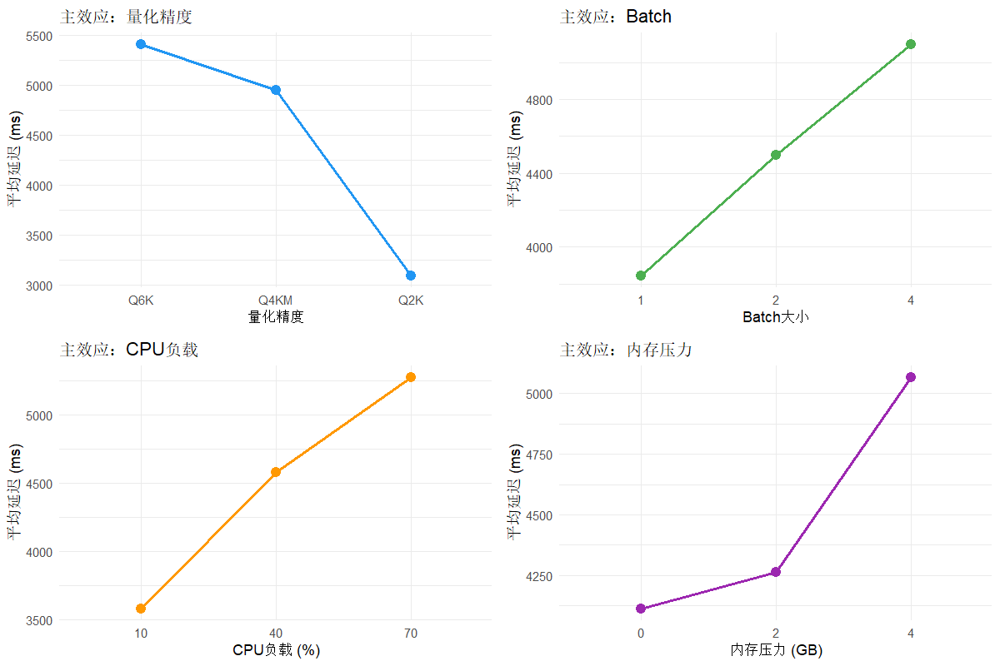
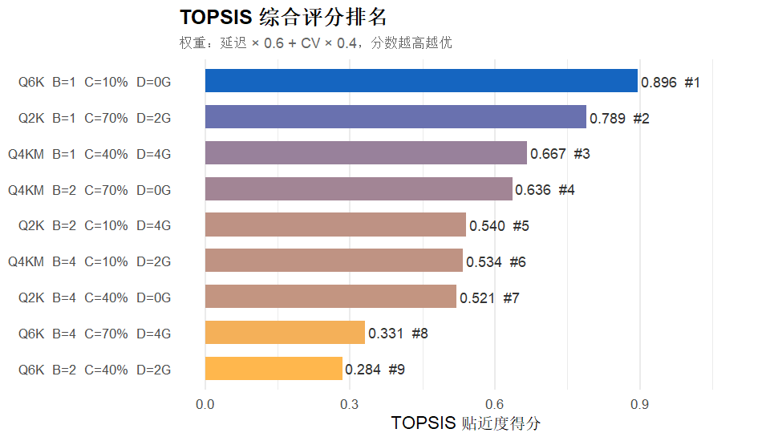
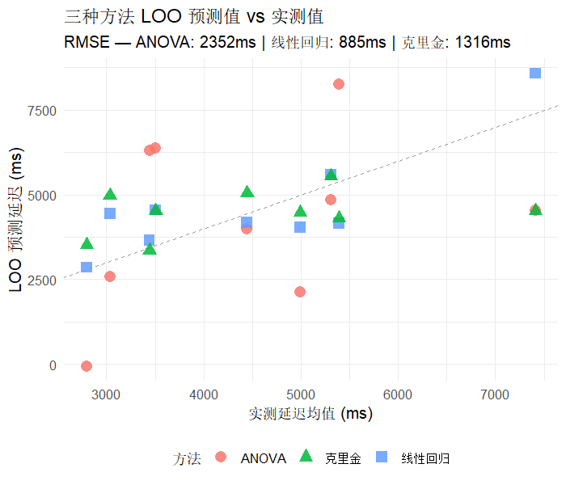

# LLM推理延迟多因素正交试验

> 《试验设计》期中作业

## 项目简介

以本地部署的大语言模型推理服务为对象，采用 **L9(3⁴) 正交表**
考察4个因子对推理延迟的影响，通过三种统计方法建模，
并用 TOPSIS 多准则决策识别最优参数组合。

## 因子与水平

| 因子 | 符号 | 水平 |
|------|------|------|
| 量化精度 | A | Q6K / Q4KM / Q2K |
| Batch大小 | B | 1 / 2 / 4 |
| CPU负载 | C | 10% / 40% / 70% |
| 内存压力 | D | 0 / 2 / 4 GB |

9组合 × 20次重复 = **180条原始记录**

## 主要结论

- **最关键因子**：量化精度（η² = 36.6%），其次为CPU负载（17.7%）
- **最优参数组合**：Q6K + Batch=1 + CPU=10% + 内存=0GB
  （TOPSIS得分 0.896，延迟均值 3506ms，CV 3.3%）
- **最佳预测模型**：多元线性回归（LOO-RMSE = 885ms，R² = 0.923）

## 文件结构

```
├── data/
│   ├── results.csv               原始测量数据（180条）
│   ├── summary_stats.csv         各组合描述统计
│   ├── method_comparison.csv     三种方法精度比较
│   ├── topsis_result.csv         TOPSIS综合评分排名
│   ├── main_effects.png          四因子主效应图
│   ├── method_comparison_plot.png LOO预测vs实测散点图
│   └── topsis_ranking.png        TOPSIS排名条形图
├── 01_collect.py                 数据采集脚本（Python）
├── 02_analyze.R                  统计分析脚本（R）
├── analysis_notes.txt            详细文字分析说明
├── requirements.txt              依赖包列表
└── README.md                     本文件
```

## 快速复现

### 环境

```r
install.packages(c(
  "tidyverse", "car", "gridExtra",
  "DiceKriging", "lmtest", "Metrics"
))
```

### 运行

```r
source("02_analyze.R")
# 输出文件自动保存到 data/ 目录
```

## 结果预览

### 主效应图


### TOPSIS排名


### 三方法预测比较


## 详细分析

完整的数据解读见 [`analysis_notes.txt`](analysis_notes.txt)